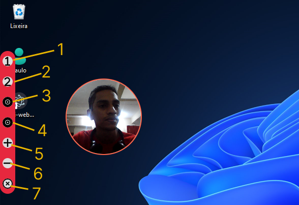

# Mini Webcam - (Electronjs)

## ***Mini Webcam*** feito com electronjs. Com gravação de posições e tamanhos e atalhos.

<div align="center">
    
</div>

## Funções

- 1 - Mudar para cena 1 (CTRL+1)
- 2 - Mudar para cena 2 (CTRL+2)
- 3 - Gravar a posição 1
- 4 - Gravar a posição 2
- 5 - Aumentar do frame da câmera
- 6 - Diminuir do frame da câmera
- 7 - Fechar aplicação

## Como usar

```bash
git clone https://github.com/saulotarsobc/SC-Mini-Webcam.git;
cd SC-Mini-Webcam;
npm run install;
npm run start;
# para gerar um .exe na pasta 'dist'
npm run win;
```
